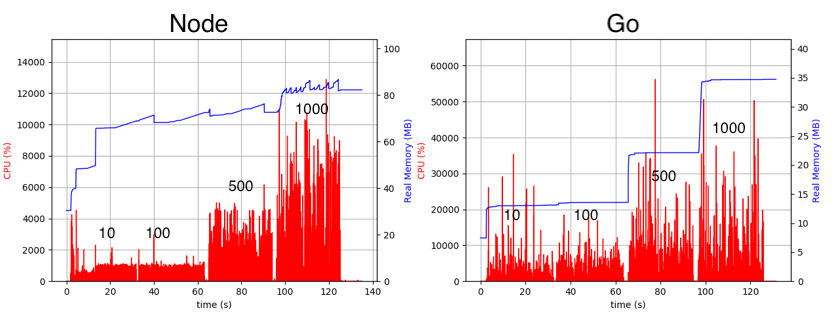

# Node vs Go: when to use what?

This is a case-by-case Node.js vs Go performance comparison, demonstraiting some pitfalls of the signle-threaded nature of Node.js that, when ignored, starts being a problem under certain load and conditions. In no way it means that Go is "better" than Node.js and we will start using it everywhere and for everything like other cool kids over there. This analysis is an attempt to come up with some rules of thumb for choosing one language over another for your projects/microservices. 

## Node.js and when to use it 

Node can handle a lot of load when well used, while allowing you to move fast, release and prototype features rapidly. This is essential when your problem domain is vague/shady.

1. You expect less than 4-5k RPS,
2. Most of what your server does is I/O (I'd say >95%),
3. Your server is small, simple and unifunctional. In a sense that it's not designed to be a Swiss knife that deals with many different problem domains at once (monolith is an anti-pattern for Node),
4. You want to prototype something and move fast.

The official Node.js documentation states: _Here's a good rule of thumb for keeping your Node server speedy: Node is fast when the work associated with each client at any given time is "small"_. Ok, what does "small" mean? You can think of Node.js as a very performant I/O router. If most of what your server does is I/O and there're no expensive blocking operations surrounding the I/O (like heavy computations or sophisticated data procesding bits), it can be a great choice for your project that handles roughly 4-5k RPS with stable and predictable latency. See [How computation affects the latency and monolyth antipattern](#how-computation-affects-the-latency-or-why-node-monolyth-is-an-antipattern) 

## Go and when to use it

Either
1. You expect a lot of load on your server: >5k RPS per instance/node,
2. Your server needs to do heavy computations, sophisticated data verification logic or anything that burns CPU cycles that slows Node down,
3. You grow out of Node.js and want to improve performance.

Go is definitely much more performant. Unlike Node, it combines parallelism and concurrency incorporated to the concept of goroutines ([green threads](https://en.wikipedia.org/wiki/Green_threads)). Performance comes with a price of dealing with some low-level details. And that makes  room for human error: like using shared resources from many goroutines, or necessity to release some of system resources manually - like file descriptors, which can lead to a memory leak. Go is harder to use and debug, so if you need to prototype or release fast, it's not the best option. Use Node.js instead, you can always switch to Go once the problem domain is demistified and performance becomes a problem.

## TL;DRs

1. Node can handle something like 5-10k RPS with an appropriate latency if your main load is I/O (see [Max RPS](#max-rps-and-how-number-of-simultaneous-connections-affect-performance))
2. Go can handle at least 4 times more because it utilises parallelism in a very efficient way (see [Max RPS](#max-rps-and-how-number-of-simultaneous-connections-affect-performance))
3. Be mindful about how many connections you hold open to databases and other microservices. Too few connections may result in bad latency, while too many can make your server burn CPU cycles for managing sockets and switching between them. Use connection pooling when possible. (see [Max RPS](#max-rps-and-how-number-of-simultaneous-connections-affect-performance))
4. If your service has to talk to other microservices/database, make sure that the latency stays below 50ms. Even though it's a very rough estimate, it helps avoiding potential response time problems that won't  be reflected in how many RPS your server can handle. (see [Introducing a delay](#introducing-a-delay))
5. Node's latency hits the rock bottom if it has to perform long computations. The situation gets worse if you mix lightweight I/O-intensive requests with heavyweight CPU-intensive ones in one process. Even if there's something like 1% of heavyweight requests, they will affect the lightweight ones (see [How computation affects the latency and monolyth antipattern](#how-computation-affect-latency-or-why-node-monolyth-is-an-antipattern))

## TOC

* [Max RPS and how number of simultaneous connections affect performance](#max-rps-and-how-number-of-simultaneous-connections-affect-performance)
* [Introducing a delay](#introducing-a-delay)
* [How computation affects the latency and monolyth antipattern](#how-computation-affect-latency-or-why-node-monolyth-is-an-antipattern)

# Performance analysis

_As a side note: on some of the graphs you can notice that the CPU usage is in percents, the actual values go way above 1k. Well, blame psutil for OSX and the way it collects CPU usage for a selected process. Just treat it as some kind of index, higher the value -- higher the usage._

## Max RPS and how number of simultaneous connections affect performance

Let's see how much we can squeeze from Node.js and Go HTTP servers on my local machine (OSX, 3.1 GHz Intel Core i5, 8 GB 2133 MHz RAM), by calling a route that returns the current timestamp. 

Go server can handle at least 3-4 times more RPS than the Node one with much better and stable latency. I said "at least" because the benchmark and the server were launched on the same machine, so they were competing for resources (like CPU), which didn't allow the Go server run at full scale. Take a look at the table below:

| Server | Number Of Connectinos | RPS | Mean Latency (ms) | Std. Dev |
| :---: | :---: | :---: | :---: | :---: |
| Node | 10 | 12.9K | 37.4 | 95 |
| Go | 10 | 39.5k | 164 | 108 | 
| Node | 100 | 12.9K | 7 | 10 |
| Go | 100 | 39K | 3 | 2 |
| Node | 500 | 12.5k | 67.5 | 135 |
| Go | 500 | 38.6k | 6.2 | 3.8 |
| Node | 1000 | 12.1k | 437 | 103.5 |
| Go | 1000 | 38k | 13.8 | 7.7 | 

Number of connections indicates how many sockets are used simultaneously to pass the the traffic to the server. A useful way to think of it as number of, say, DB connections in a pool your server keeps open. As you can see from the table, changing this number can affect server latency but not the RPS (well, not too much). Why is it the case? 

* Increasing the number of connections from 10 to 100 made Node latency 5 times better and Go latency 82 times better. Every connection/socket has a queue maintained by the OS kernel, where it stores the responses before passing them to the underlying network device and requests before starting handling them. If the device is busy, more and more requests and responses get queued and since the queues size is limited. At some point they get full and become a bottleneck. Adding more connections/sockets gives your server more queues where it can redistributed requests and responses more efficiently.

* Increasing the number of connections from 100 to 500 and then to 1000 made latency of both Node.js and Go servers worse, although for Node it was much worse. Node: 7ms -> 67.5ms -> 437ms. Go: 2ms -> 6.2ms -> 13.8ms. What happened and why Node was affected more than Go? Every new connection, say in your database connections pool, becomes a new source of events for your server. At some point switching between different sources-of-events/connections becomes a expensive blocking operation. Node is affected by that much more than Go. This happens because it could not utilise parallelism and handle different connections simultaneously on different cores.

Take a look at the performance graph below (the numbers on the top state how many simultaneous connections were used during the test):

CPU usage wasn't affected by switching from 10 to 100 connections. Although, it spiked on transitioning from 100 to 500 and from 500 to 1000. This agrees with the explanation that at some point managing connections becomes a CPU intensive tasks. Go uses much more CPU than Node.js, that's because it incorporates parallelism and tries to utilise all the available cores to maximise efficiency. Which you could see from the benchmark results.

Speaking of efficiency, take a look at the latency percentiles graph below. You can see that the Go server handles almost 40k RPS (green and blue lines) and is more responsive versus the Node.js server handling only 13k (green and orange lines):

## Introducing a delay

Now the benchmark tries to send 10k RPS to the servers that do exactly the same thing: reply with a current timestamp.  Before they reply an artificial delay is introduced. You can think of the delay as of some asynchronous I/O operation that has to be `await`'ed before the server can send a reply back (like talking with a DB or another micro-service). The table below demonstrates how different delays (in ms) affect the latency of your server:

| Server | Delay (ms) | RPS | Mean Latency (ms) | Std. Dev |
| :---: | :---: | :---: | :---: | :---: |
| Node | 0 | 9.7k | 6.7 | 3.4 |
| Go | 0 | 9.7k | 2.7 | 5.4 |
| Node | 10 | 9.6k | 22.4 | 6.4 |
| Go | 10 |   9.6k | 13.2 | 2 | 
| Node | 20 | 9.7k | 24.1 | 1.7 |
| Go | 20 | 9.7k | 22.1 | 1 |
| Node | 30 | 9.7k | 42.6 | 5.3 |
| Go | 30 | 9.7k | 32.6 | 1.6 |
| Node | 40 | 9.6k | 241 | 672 |
| Go | 40 | 9.7k | 42 | 1.7 |
| Node | 50 | 8.3k | 2774 | 966 | 
| Go | 50 | 8.9k | 1550 | 611 | 

* As you can see, starting from 30ms delay, Node increases median latency by ~10ms.
* Things get worse when we increase the delay to 40ms (at this point Node's latency grows 6 times but Go manages to cope up)
* Finally, both Node and Go, start having serious response time problems once the delay jumps to 50ms.

What's going on here? The amount of time your server will have to hold a request in a queue is proportional to the delay the reply depends on. You can see on the graphs below how the memory usage growth as we increase the delay (black numbers on top of the charts). At some point the queues get polluted much faster than than the server can clean them up.

And a latency histogram:

## How computation affects the latency? (or why Node monolyth is an antipattern)

In this experiment we introduce an inexpensive computation (taking ~1ms) that happens with some pre-selected probability, before the servers return current timestamp. Let's say that 100ms is an appropriate latency for good user experience. You may think that nothing can go wrong if only 1% of the overall latency is dedicated to computation which take place in only 1% of overall requests. Everything can go wrong. Take a look at the table below. The "Requests With Computation" column indicates the percent of requests that are affect by 1ms computation (other requests will return current timestamp right away).

| Server | Requests With Computation (%) | RPS | Mean Latency (ms) | Std. Dev |
| :---: | :---: | :---: | :---: | :---: |
| Node | 0 | 9.7k | 18.1 | 10.1 |
| Go | 0 | 9.7k | 12.1 | 1.5 | 
| Node | 1 | 7k | 8830 | 1849 |
| Go | 1 | 9.6k | 13.1 | 2 |
| Node | 10 | 3.6k | 12521 | 2405 |
| Go | 10 | 9.6k | 17.4 | 4.2 |
| Node | 25 | 3.8k | 15319 | 3427 |
| Go | 25 | 8.1k | 3409 | 981 |
| Node | 50 | 1.6k | 14358 | 5236 |
| Go | 50 | 4.7k | 10000 | 2797 |  

* What you can see from the table is that even if only 1% of all requests are affected by  an inexpensive computation operation, Node's latency goes sky high - actually almost 488 times higher. 
* As we keep increasing the percent of affected requests, Node gets worse and worse, but Go somehow keeps doing a good job.
* Only once 25% of requests are affected by a computation, Go's latency grows to the mark of 3.5s (still much better than what Node could do with only 1% of computation requests -- 8.8s).

So, what's going on here and why Go is so much more efficient? It's all about blocking the event loop with a synchronous operation (like wasting CPU cicles on some calculations) during which Node can not keep doing the I/O. Even if only 1% of all requests ends up doing CPU-intensive work, the latency changes in case of Node as the main and only thread of the Node process get blocked by computation. Go doesn't have too much trouble with it as it utilises parallelism. Even if the request is one of those that can burn CPU cycles for some time, there're other threads that can keep dealing with the I/O. Only when the percent of computation-intensive requests gets too big (like 25%), Go starts having the same problems as Node does, as the chance of every OS thread (or a CPU core if you will) being busy gets higher.

Take a look at the performance stats below:

Look at these shaky waves on the Node's memory usage graph. Memory usage jumps in such a way, because Node has to keep more requests queued, if the event loop is blocked by a synchronous computation operation. Go solves the "blocking problem" by utilising all available CPU cores, that's why you see CPU usage on the Go's graph growing proportionally with percent of computationally-heavy requests.

Finally, a latency histogram:

